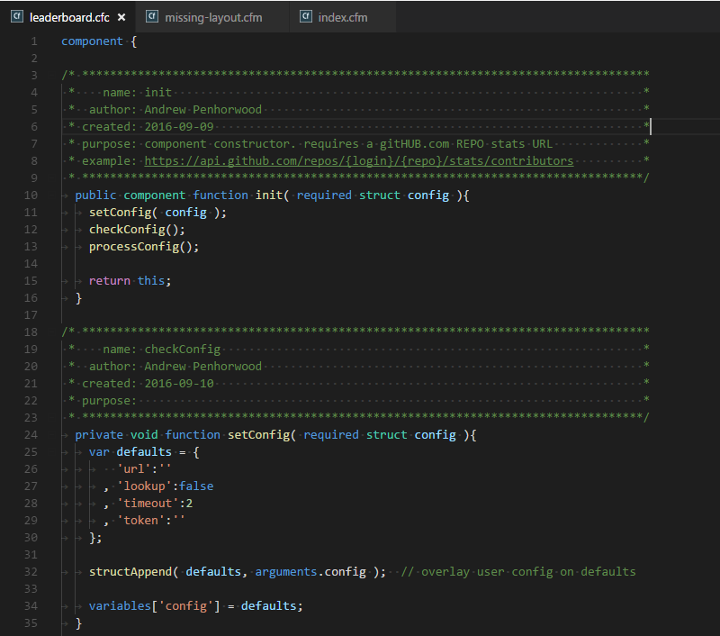
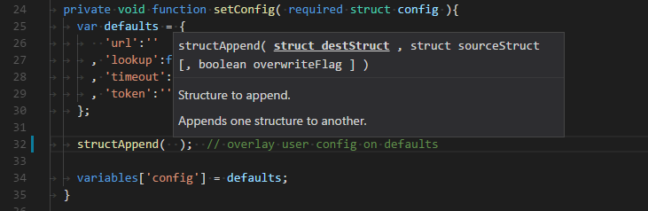
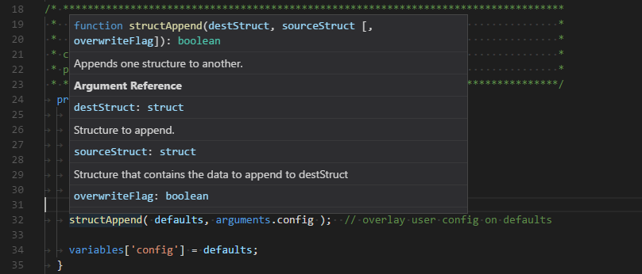
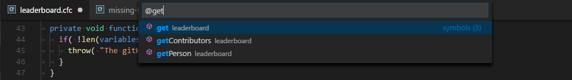
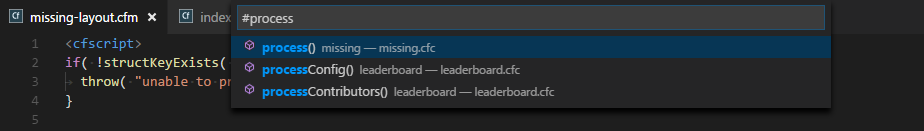
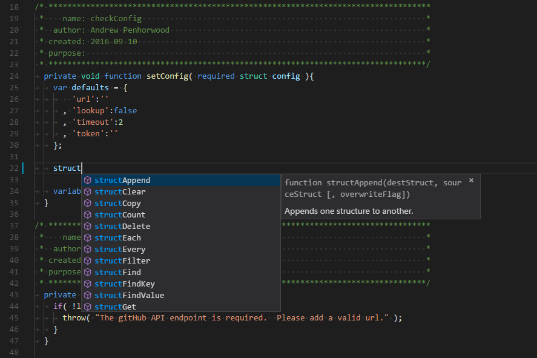
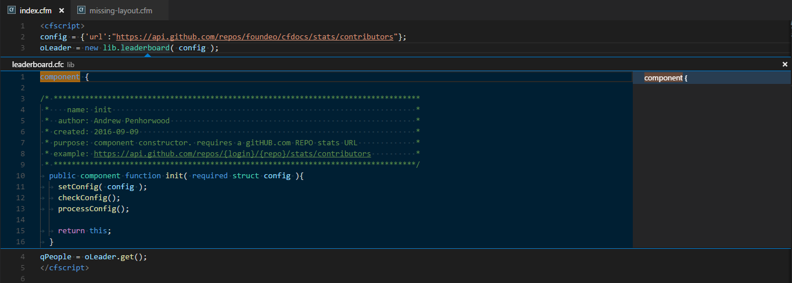

# VS Code CFML

An extension for Visual Studio Code to assist in development with CFML.

## Acknowledgements

- [`vscode-coldfusion`](https://github.com/ilich/vscode-coldfusion/) on which the syntax highlighting is based, which was based on the next extension
- [`sublimetext-cfml`](https://github.com/jcberquist/sublimetext-cfml) as inspiration for some of the features. "Parsing" logic (including regexes) was also used.
- [`cfdocs`](https://github.com/foundeo/cfdocs/) as the default documentation and sample images in this README
- [`vscode-php-docblocker`](https://github.com/neild3r/vscode-php-docblocker) as the basis for docblock completion

## Features

1. **Syntax Highlighting**  


1. **Signature Help**  
Automatically triggers within signature of a function or can be manually triggered. Currently limited to CFML global functions and internal component functions.  
Win/Linux: `Ctrl+Shift+Space`; Mac: `Cmd+Shift+Space`


1. **Hover Documentation**  
Displays documentation for functions and tags. Currently limited to CFML global functions and tags and internal component functions. Does not consider context, so it may also trigger on SQL or JavaScript functions with the same name.  
Win/Linux: `Ctrl+K Ctrl+I`; Mac: `Cmd+K Cmd+I`


1. **Document Symbols**  
Search symbols within a document.  
Win/Linux: `Ctrl+Shift+O`; Mac: `Cmd+Shift+O`


1. **Workspace Symbols**  
Search symbols within the workspace. Limited to components and their function declarations.  
Win/Linux: `Ctrl+T`; Mac: `Cmd+T`


1. **Completion Suggestions**  
Suggestions for global functions and tags, tag attributes, internal user functions, keywords, scopes, component properties, variables, and docblocks.  
Win/Linux: `Ctrl+Space`; Mac: `Cmd+Space`


1. **Definition**
Provides a link to the definition of a symbol. Currently only for object creation, function usage within its same component, function return types, argument types, property types, and component extends.  
_Go to Definition:_ Win/Linux: `F12`/`Ctrl+Click`; Mac: `F12`  
_Peek Definition:_ Win/Linux: `Alt+F12` (`Ctrl`+hover provides a smaller, alternate peek); Mac: `Opt+F12`


## Settings

The following are the configurable Settings (Win/Linux: `Ctrl+Comma`; Mac: `Cmd+Comma`) that this extension contributes to VS Code:

- `cfml.globalDefinitions.source`: The source of the global definitions. Currently only supports CFDocs. [*Default*: `cfdocs`].
- `cfml.cfDocs.localPath`: [*Optional*] Absolute path to the data directory of CFDocs.
- `cfml.cfDocs.source`: Indicates which source will be used for CFDocs.  
**Values**
  - `remote`: Retrieve resources remotely from GitHub. [*Default*]
  - `local`: Retrieve resources locally using `cfml.cfDocs.localPath`.
- `cfml.hover.enable`: Whether hover is enabled. [*Default*: `true`]
- `cfml.signature.enable`: Whether signature help is enabled. [*Default*: `true`]
- `cfml.suggest.enable`: Whether completion help is enabled. [*Default*: `true`]
- `cfml.suggest.snippets.enable`: Whether snippets are part of completion help. [*Default*: `true`]
- `cfml.suggest.snippets.exclude`: Set of snippet keys you would like excluded from suggestions. See [snippets.json](./snippets/snippets.json).
- `cfml.suggest.globalFunctions.enable`: Whether global functions are part of completion help. [*Default*: `true`]
- `cfml.indexComponents.enable`: Whether to index all components in workspace on startup. This is done on each startup and duration depends on number and complexity of components as well as hardware specifications. Editor may be unresponsive during this period. It is currently required for most features involving components. [*Default*: `true`]
- `cfml.autoCloseTags.enable`: Whether to enable auto-closing tags for CFML. This uses the third-party extension `auto-close-tag`. Changing this requires a restart. [*Default*: `true`]
- `cfml.autoCloseTags.configurationTarget`: Auto-configuration target for auto-closing tags. [*Default*: `Global`]
- `cfml.emmet.enable`: Whether to enable Emmet for CFML. Changing this requires a restart. [*Default*: `false`]
- `cfml.emmet.configurationTarget`: Auto-configuration target for Emmet. [*Default*: `Global`]
- `cfml.docBlock.gap`: Whether there should be a gap between the hint and other tags in a docblock. [*Default*: `true`]
- `cfml.docBlock.extra`: Extra tags you would like to include in every docblock  
  **Example**
    ```json
    "cfml.docBlock.extra": [
        {
            "name": "output",
            "default": "false",
            "types": [
                "component",
                "function"
            ]
        }
    ]
    ```

## Commands

Used in Command Palette (Win/Linux: `Ctrl+Shift+P`; Mac: `Cmd+Shift+P`). Can also be bound to Keyboard Shortcuts (Win/Linux: `Ctrl+K Ctrl+S`; Mac: `Cmd+K Cmd+S`).

- Refresh cache for global definitions
- Refresh cache for workspace definitions
- Toggle CFML line comments (`Ctrl+/`)
- Toggle CFML block comments (`Shift+Alt+A`)

## Known Issues/Limitations

1. As currently implemented, there is no embedded language support. Unfortunately, VS Code does not currently seem to have this native capability. This means that you will not get robust HTML/CSS/JS assistance within CFML files. You will still get syntax highlighting and you can use user snippets and Emmet to supplement somewhat.
1. An extension of the issue above is that as implemented there is only one language defined for CFML. This can cause a number of issues where functionality or settings are based on language ID. For example, with Emmet enabled, you will get the Emmet functionality throughout the CFML files and contexts.
1. Removing, moving, or renaming folders does not update the workspace definitions or symbols and will cause discrepancies with those resources. For now, you can use the command to refresh workspace definitions at any time.
1. Completion suggestions are not always properly contextual.
1. The "parsing" is done with regular expressions without considering context in most cases, which means you will get non-CFML being parsed as CFML. This also means that strings and comments will often be parsed as if they were part of code.

## Future Plans

Feel free to open issues for these or any other features you would find helpful so we can discuss.

- Filter global functions and tags based on engine setting
- Signature help for external component functions
- Hover documentation for external component functions
- Provide additional completion suggestions
  - Enumerated values
  - Script-based tag functions
  - Script-based tag attribute names
  - External component functions
  - Component paths
  - Global member functions
- Definitions for more contexts
- Type Definitions
- References
- Add additional formats to supported global definitions source (e.g. CFBuilder)
- Custom mapping
- Use proper parser ([CFParser](https://github.com/cfparser/cfparser))
- Utilize a CFML language server

## Recommended Extensions

VS Code and this extension lack features and functionality that I find useful for development. Below are some supplemental extensions that I believe will improve the development experience for most.

- [Auto Close Tag](https://marketplace.visualstudio.com/items?itemName=formulahendry.auto-close-tag) - Enables automatic closing of tags. There are settings (`cfml.autoCloseTags.*`) to automate the configuration for HTML and CFML tags.
- [CFLint](https://marketplace.visualstudio.com/items?itemName=KamasamaK.vscode-cflint) - Integrates CFLint into VS Code as diagnostics.
- [highlight-matching-tag](https://marketplace.visualstudio.com/items?itemName=vincaslt.highlight-matching-tag) - This seems to break often, but I've found it to work just enough to be useful.
- [Path Intellisense](https://marketplace.visualstudio.com/items?itemName=christian-kohler.path-intellisense) - Provides suggestions when entering file paths
- [Code Outline](https://marketplace.visualstudio.com/items?itemName=patrys.vscode-code-outline) - Displays document symbols in an outline view in the Explorer
- [TODO Highlight](https://marketplace.visualstudio.com/items?itemName=wayou.vscode-todo-highlight)

## Release Notes

See [CHANGELOG.md](/CHANGELOG.md)

## Contributing

See [CONTRIBUTING.md](/CONTRIBUTING.md)
